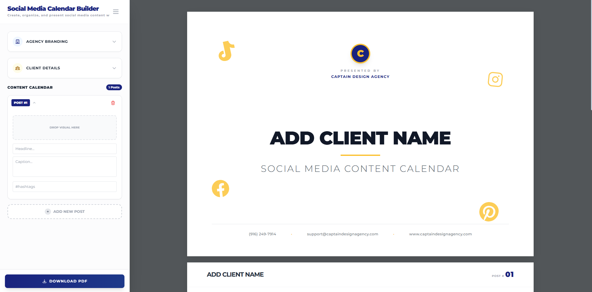
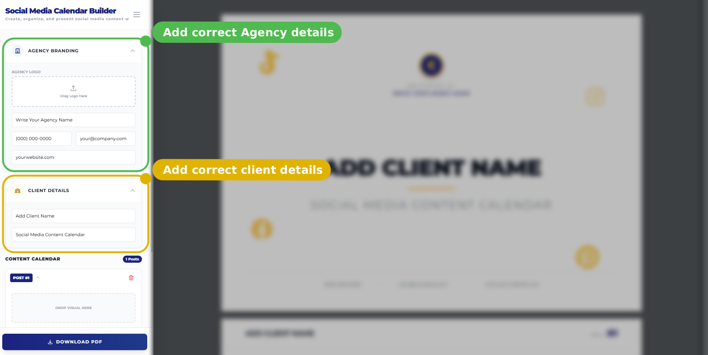
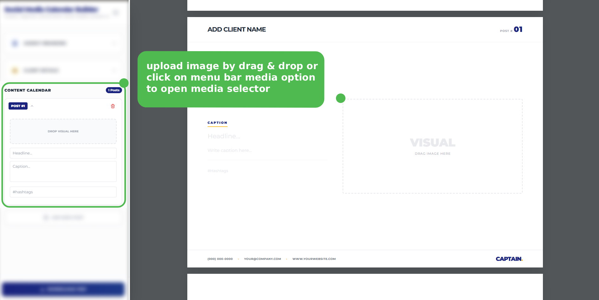
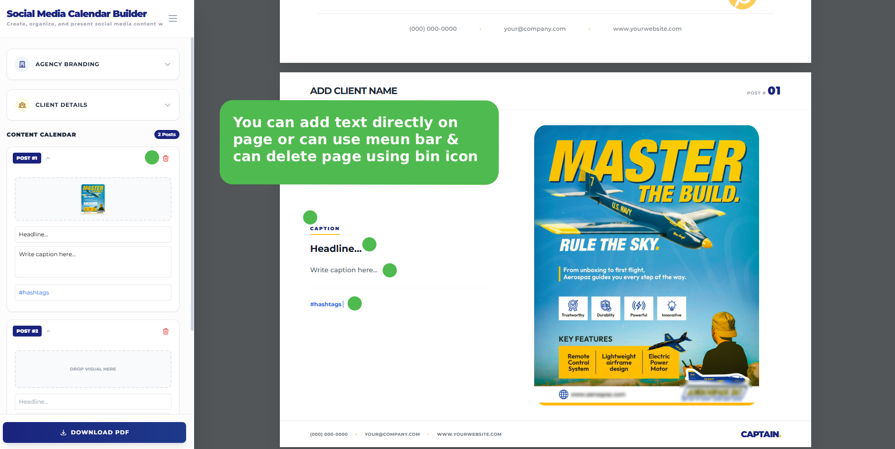

# Free Social Media Posts Calendar Builder | Drag & Drop

A beautiful, free, and completely browser-based tool to create, organize, and present social media content to your clients. Everything happens in your browser with zero setup, databases, or logins required.

## 🌟 Features & Usage Guide

### 1. The Main Interface
The entire builder works beautifully on one screen. The left sidebar contains all your controls, while the right side shows a real-time, high-fidelity A4 preview of exactly what your client will see when you download the final PDF.

### 2. Agency Branding & Client Details
Make the calendar yours before presenting it.
- **Agency Branding:** In the left sidebar, click on **AGENCY BRANDING**. Simply drag and drop your agency's logo and fill out your Agency Name, Phone, Email, and Website.
- **Client Details:** Click **CLIENT DETAILS** to add the Client Name and a Subtitle.
- These details dynamically populate the header, footer, and "Thank You" page of the final PDF.

### 3. Drag & Drop Content Calendar
This is where the magic happens. You can build out posts sequentially with rich visual previews.
- **Add a Post:** Click the "+ ADD NEW POST" button at the bottom of the sidebar.
- **Upload Visuals:** Drag and drop images *directly* onto the big placeholder in the right-side preview, or use the smaller drop zone in the left sidebar.
- **Details:** Fill in the **Headline**, **Caption**, and **#hashtags**.
- **Edit/Delete:** You can edit these directly in the sidebar or click the red trash can icon next to a post to delete it.

### 4. Download HD PDF
When you're happy with your content calendar:
1. Click the large blue **DOWNLOAD PDF** button at the bottom of the sidebar.
2. The tool will process the visual layout and generate a clean, multi-page, non-interactive PDF perfectly formatted for presentation.

> ⚠️ **Important Data Privacy Note:**
> We prioritize your privacy! This tool is 100% client-side. **We do not save any of your data to a database.** Everything lives temporarily in your browser's memory.
>
> *This means if you refresh or close the tab, any uncompleted work or uploaded images will be permanently lost.* Make sure to download your PDF before leaving the page!

## 🚀 How to Use (No Installation Required!)

You don't need to install anything or sign up for an account.

Just visit the live site and start building:
👉 **[https://hamza-jawaid.github.io/calendar/](https://hamza-jawaid.github.io/calendar/)**
